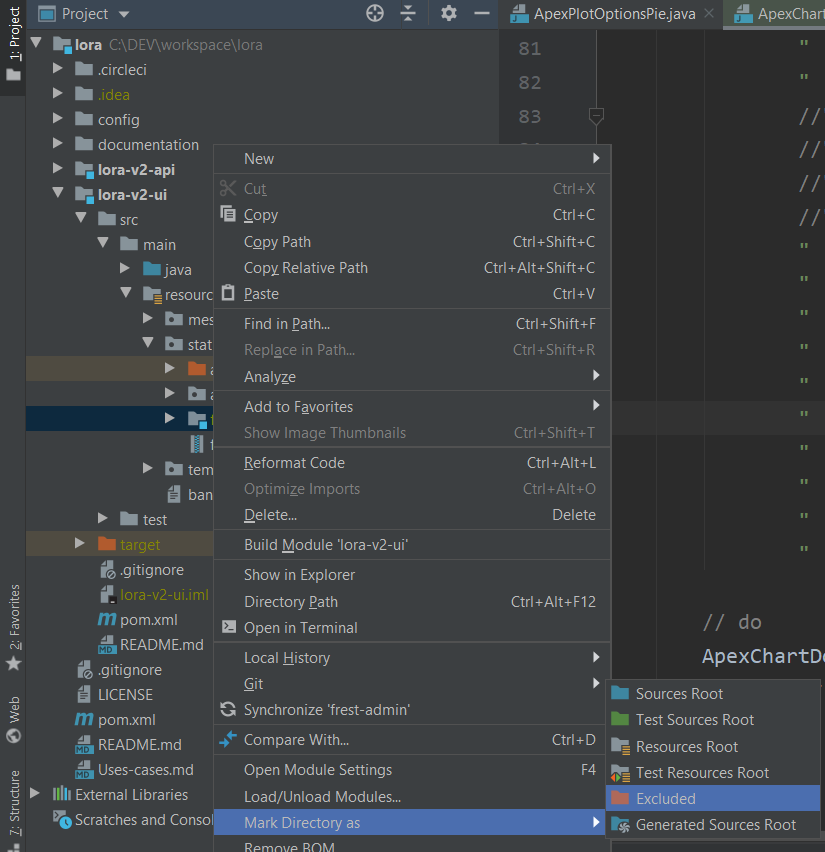

# Tracker application

To follow up on Internet activity and downloaded files.

--------------------------

##  Project description

TODO

## How to execute?

The setup process is straight-forward:
- `git clone https://github.com/guihome-diaz/java.git`
- `git checkout develop`
- Optional: add _frest-admin template_ examples to the build
  - `unzip tracker-ui/src/main/resources/static/frest-admin.zip -d tracker-ui/src/main/resources/static/`
- `mvn clean install`

### Launch User Interface

The user interface is inside a dedicated project called "_tracker-ui_" on port **TCP 9090**:
- `java -jar tracker-ui/target/tracker-ui-0.0.1-SNAPSHOT.war`

From that moment on you can access the **User Interface** at http://localhost:9090

### Launch web-services REST API

The user interface is inside a dedicated project called "tracker-api" on port **TCP 9100**:
- `java -jar tracker-api/target/tracker-api-0.0.1-SNAPSHOT.war`

From that moment on you can access the **Tracker API** at http://localhost:9100

--------------------------

## How to acces UI "frest-admin" template?

The template is included inside the project.

* Navigate to help page
  * Launch web-browser
  * Go to [http://localhost:9090/frest-admin/index.html](http://localhost:9090/frest-admin/index.html)

(i) you can also access the template examples from the navigation menu, under _administration_ > _View Frest-admin template_ > **Go To Horizontal Menu Template LTR**

--------------------------

## Requirements

### GIT 

You must be able to perform git operations. Team's developers use git **2.19.2**. Download the last release of GIT on the official website: [git-scm.com](https://www.git-scm.com/)

### Java version

This library requires **Java 11** (Oracle JDK or OpenJDK) or higher. Get it from OpenJDK: [jdk.java.net](http://jdk.java.net/)

### Maven version

This library requires **maven 3.6** or higher. Get last version at [maven.apache.org](https://maven.apache.org/download.cgi)

## IntelliJ configuration

IntelliJ is a wonderful IDE, but it will be slow due to the amount of template files. **Add exclusions to speed-up the IDE**:

You need to mark as 'excluded' the folders:
* tracker-ui/src/main/resources/static/frest-admin
* tracker-ui/src/main/resources/static/app-assets

To mark a directory as 'excluded': 
* right click on the directory 
* Mark directory as > Excluded
* 

--------------------------

## Licence / legal aspects

### 3rd party licenses and links

This application uses some none-free components: 
- User Interface uses [Frest Admin template](https://www.pixinvent.com/demo/frest-clean-bootstrap-admin-dashboard-template/landing-page/)
  - We are currently using a _regular license_ that is only suitable for development and tests purposes. This is not production ready
  - Link to [Pixent template's documentation](https://pixinvent.com/demo/frest-clean-bootstrap-admin-dashboard-template/documentation)

--------------------------

